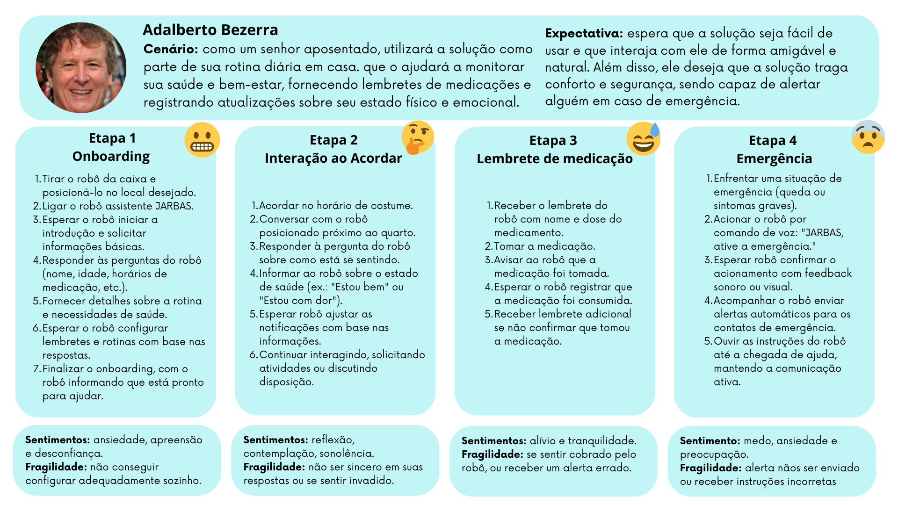
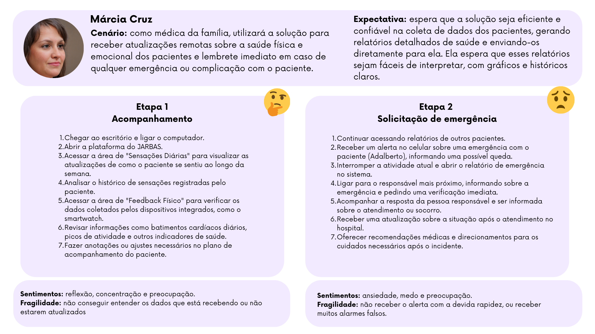

&emsp;&emsp;A jornada do usuário é um conceito fundamental no design de experiências digitais, que descreve o caminho percorrido pelo usuário ao interagir com um sistema ou produto, desde o primeiro contato até a conclusão de seus objetivos.  Ao compreender cada uma dessas fases, as equipes de design e desenvolvimento conseguem identificar as necessidades, expectativas e desafios enfrentados pelos usuários ao longo de sua interação com o sistema.

&emsp;&emsp;Ao mapear essa jornada, é possível detectar pontos de dor e oportunidades de melhoria, permitindo que a equipe desenvolva soluções mais eficientes e centradas no usuário. Além disso, entender a jornada ajuda a alinhar os objetivos de negócios com as necessidades dos usuários, resultando em produtos mais intuitivos, acessíveis e que geram satisfação. 

&emsp;&emsp;A seguir, é possívela acompanhar a jornadas dos usuários descritos anteriormente, bem como os pontos de atenção que são possíveis de captar aoanalisá-las.

## Adalberto

 Figura 1 - Jornada Adalberto 

Fonte: Elaborado pela equipe J.A.R.B.A.S.

&emsp;&emsp;A análise da jornada de Adalberto revela diversos pontos de atenção, que se destacam pelos sentimentos e fragilidades presentes em cada etapa do processo. 

&emsp;&emsp;Na primeira etapa, a principal fragilidade é garantir que o sistema seja intuitivo o suficiente para que Adalberto consiga realizar as configurações iniciais de forma autônoma. Se os comandos forem excessivamente complexos, considerando seu nível de letramento digital, ou se o processo incluir um questionário muito extenso, isso pode se tornar uma barreira, levando à frustração e ao estresse em um momento que normalmente já provoca ansiedade.

&emsp;&emsp;Na segunda etapa, é fundamental que a interação entre o robô e Adalberto seja fluida e dinâmica. É crucial evitar a sensação de observação e invasão, que pode resultar em respostas falsas por parte do usuário e frustração em uma etapa que deve ser essencialmente reflexiva.

&emsp;&emsp;Na terceira etapa, a fragilidade maior reside na necessidade de que a dinâmica do robô seja o mais amigável possível, sem transmitir uma cobrança excessiva que possa repelir o usuário. O sentimento que a solução deve evocar é o alívio, garantindo que Adalberto se sinta seguro em saber que está tomando sua medicação dentro do horário e seguindo adequadamente seu tratamento.

&emsp;&emsp;A quarta etapa apresenta um alto nível de fragilidade, pois envolve situações de emergência, que naturalmente geram medo e apreensão no usuário. A maior preocupação é garantir que o alerta de emergência seja enviado de forma rápida e eficiente, além de fornecer informações úteis e precisas para Adalberto enquanto alguém não chega. A demora ou o envio de informações incorretas podem agravar ainda mais a situação, aumentando o nível de estresse e insegurança do usuário.

&emsp;&emsp;Além disso, há uma fragilidade adicional que permeia toda a jornada, relacionada à necessidade de o robô reconhecer o ambiente de maneira eficaz, especialmente em situações que envolvem obstáculos ou acidentes que o paciente possa sofrer. Essa fragilidade pode impactar o fluxo de qualquer uma das etapas mencionadas, comprometendo a eficácia da solução e a segurança do usuário.

## Márcia

 Figura 2 - Jornada Márcia 

Fonte: Elaborado pela equipe J.A.R.B.A.S.

&emsp;&emsp;Ao analisar a jornada de Márcia, é possível identificar outros pontos de fragilidade que surgem do outro lado da solução e que devem ser destacados e considerados durante o desenvolvimento.

&emsp;&emsp;Na primeira etapa, existe o risco de que os dados não sejam apresentados de forma organizada e legível para Márcia, ou que estejam em um formato muito diferente daquele ao qual ela está acostumada. Isso pode impedir que as informações sejam utilizadas de maneira benéfica. Além disso, a falta de consistência na atualização dos dados pode gerar insegurança no usuário em uma etapa que deveria ser caracterizada apenas pela reflexão e concentração na análise das informações.

&emsp;&emsp;Na segunda etapa, o nível de fragilidade aumenta, pois a situação emergencial intensifica a importância de cada ponto de atenção. Se o robô não conseguir enviar o alerta de emergência ou se houver demora na notificação, isso pode comprometer o envio de socorro e tornar a resposta ineficaz. Por outro lado, se ocorrerem muitos alarmes falsos e o sistema notificar erroneamente que o paciente está em uma situação de emergência, isso poderá afetar o julgamento da médica, fazendo com que o sistema perca sua credibilidade.

&emsp;&emsp;Com base na análise das jornadas de cada persona e dos pontos de fragilidade identificados, além do aprofundamento nas necessidades específicas de cada um, é possível desenvolver e fundamentar a solução e o sistema do J.A.R.B.A.S. com maior assertividade. Isso aumentará a probabilidade de que a solução atenda às expectativas dos usuários e esteja preparada para lidar com imprevistos que possam surgir ao longo do processo.