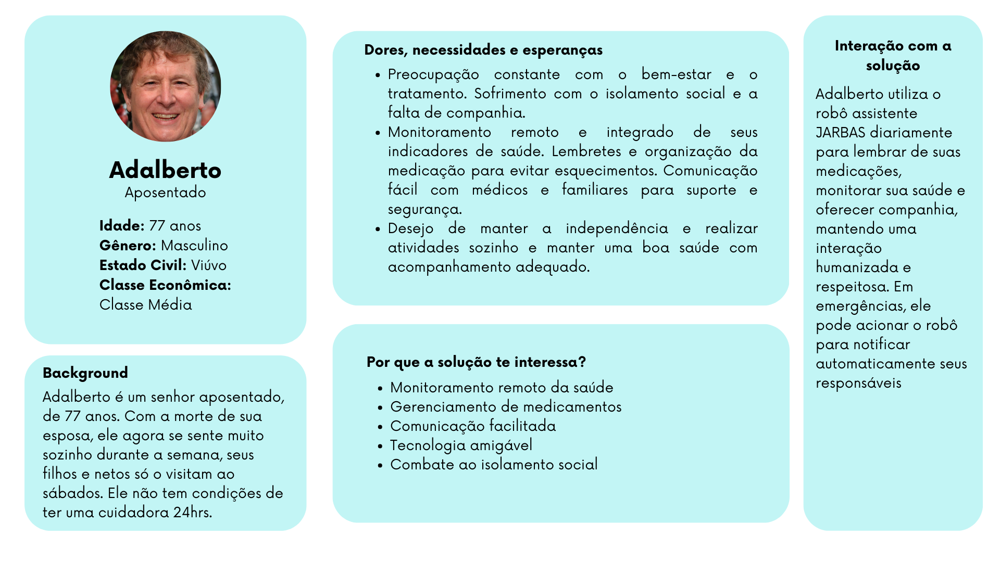
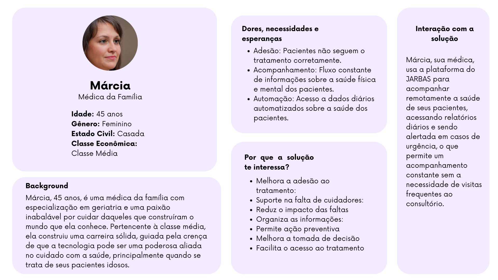

## Introdução

&emsp;&emsp;Definir personas é uma etapa essencial no desenvolvimento de qualquer projeto digital. As personas representam arquétipos de usuários reais e ajudam a equipe de desenvolvimento a entender as necessidades, desejos, dores e comportamentos de seus usuários finais. Ao ter clareza sobre quem são os principais usuários, é possível criar soluções mais direcionadas, otimizando a usabilidade e garantindo que o produto atenda às expectativas de seus públicos.

&emsp;&emsp;Serão apresentadas duas personas fundamentais para o projeto: Adalberto Bezerra, um idoso aposentado que busca independência e apoio em sua rotina de saúde, e Márcia Cruz, uma médica da família especializada em geriatria que lida com o desafio de acompanhar a saúde de seus pacientes de forma prática e eficiente.

&emsp;&emsp;Abaixo, existe uma análise detalhada de cada persona, incluindo suas necessidades, dores, desejos, preferências, interesses, hábitos e capacidades, além de suas interações com o sistema proposto.

## Persona 1: Adalberto Bezerra

 Figura 1 - Persona Adalberto 

Fonte: Elaborado pela equipe J.A.R.B.A.S.

- **Nome:** Adalberto Bezerra
- **Idade:** 77 anos
- **Profissão:** Aposentado
- **Classe Econômica:** Classe Média

### Necessidades
- **Acompanhamento contínuo da saúde:** Monitoramento regular de parâmetros vitais como pressão arterial, glicemia e frequência cardíaca, com integração automática a um aplicativo ou dispositivo que registre e envie relatórios ao médico, sem precisar sair de casa.
- **Gerenciamento de medicamentos:** Lembretes automáticos para tomar medicações, ajustados conforme prescrição médica, incluindo avisos quando os medicamentos estiverem acabando e necessitarem de reposição.
- **Facilidade de comunicação com médicos e familiares:** Um sistema de telemedicina integrado que permita contato fácil com profissionais de saúde para consultas remotas, bem como uma função de "alerta familiar" para emergências ou situações de risco.
- **Atividades que estimulem a socialização:** Oportunidades de se conectar com outras pessoas da mesma faixa etária para evitar o isolamento, como grupos de discussão online ou eventos comunitários acessíveis.

### Dores
- **Lembrança constante de cuidados de saúde:** Adalberto se preocupa com a dependência de lembretes para manter seu regime de saúde. Isso gera estresse e ansiedade, pois o esquecimento de um medicamento pode ter consequências graves.
- **Mobilidade reduzida:** Adalberto tem dificuldades em se locomover frequentemente para exames de rotina ou consultas, e acha cansativo e desgastante ter que esperar em longas filas no hospital.
- **Solidão e isolamento:** A distância de familiares e a falta de convivência diária com outras pessoas fazem com que ele se sinta solitário, especialmente em momentos em que gostaria de compartilhar histórias ou conversar.
- **Complexidade tecnológica:** Embora Adalberto tenha interesse em usar tecnologia, ele sente dificuldade em lidar com sistemas e aplicativos complicados, o que pode gerar frustração e desânimo.

### Desejos
- **Monitoramento remoto eficiente:** Ele deseja poder monitorar sua saúde sem precisar sair de casa, com relatórios automáticos e simples de entender, e receber feedback rápido dos médicos.
- **Maior autonomia:** Adalberto quer se sentir mais independente, mesmo com a idade avançada. Deseja conseguir realizar suas tarefas diárias, como marcar consultas ou pedir receitas, de maneira simples, sem precisar da ajuda de outras pessoas constantemente.
- **Conexão com outras pessoas:** Ele quer ter a oportunidade de se conectar com outras pessoas de sua idade, de maneira fácil, através de tecnologia ou atividades presenciais. Além disso, quer se sentir parte de uma comunidade, onde possa trocar experiências e evitar a solidão.
- **Segurança em emergências:** Ter à disposição um sistema confiável que possa acionar ajuda rapidamente em casos de emergência, como quedas ou problemas de saúde repentinos.

### Preferências
- **Comodidade:** Adalberto valoriza serviços e sistemas que ofereçam conveniência, como poder acessar consultas de telemedicina sem precisar sair de casa, e ter medicamentos entregues na porta.
- **Simplicidade no uso de tecnologia:** Prefere interfaces intuitivas, com botões grandes, texto claro e legível, e sistemas que exijam poucos cliques para realizar tarefas. Instruções visuais simples e interativas são fundamentais para ele.
- **Assistência personalizada:** Gosta de se sentir bem cuidado, com sistemas que oferecem soluções adaptadas às suas necessidades específicas, como lembretes ajustados aos seus horários de sono e rotinas.
- **Serviços acessíveis:** Prefere serviços que sejam financeiramente acessíveis e que não exijam custos adicionais frequentes, considerando que sua renda é mais limitada por estar aposentado.

### Interesses e Hábitos
&emsp;&emsp;Adalberto gosta de atividades leves como leitura, caminhadas curtas no parque, assistir a documentários históricos e ouvir música clássica. Ele também tem interesse em tecnologias simples que possam facilitar sua vida, como aplicativos que monitorem sua saúde.

&emsp;&emsp;Adalberto costuma começar o dia tomando café da manhã enquanto lê o jornal. Ele reserva parte do seu dia para fazer pequenos exercícios de alongamento e tomar um ar fresco. Em relação à sua saúde, tenta seguir rigorosamente o cronograma de medicações e exames, mas às vezes esquece os horários. Costuma visitar médicos ou farmácias quando é absolutamente necessário.

### Capacidades e Habilidades
&emsp;&emsp;Adalberto possui um nível básico de conhecimento em tecnologia, conseguindo utilizar smartphones para ligações, envio de mensagens e consultar aplicativos básicos. Ele é bastante cuidadoso com suas rotinas e organizado, o que facilita o uso de tecnologias que possam ajudar no monitoramento de saúde.

&emsp;&emsp;Adalberto consegue seguir instruções simples de aplicativos, como configurar lembretes e acompanhar dados em relatórios fáceis de entender. Ele também é bom em organizar suas consultas e medicamentos, apesar de depender de lembretes.

### Rotina do usuário com o sistema
- **Acompanhamento diário:** A solução estará presente desde o início do dia de Adalberto. Pela manhã, ele recebe um lembrete gentil para tomar sua medicação, com instruções claras e a dosagem correta. Esse lembrete é ajustado conforme o horário das medicações ao longo do dia, garantindo que ele não se esqueça de tomar nenhum comprimido.
- **Monitoramento de saúde:** Ao longo do dia, Adalberto pode atualizar seu estado de saúde diretamente no sistema, inserindo informações simples como seu nível de dor, cansaço ou qualquer outra alteração que ele sinta. Caso ele tenha dispositivos de monitoramento de saúde (como um medidor de pressão ou de glicose), os dados podem ser automaticamente integrados à solução, permitindo um acompanhamento mais completo sem esforço adicional.
- **Interação social e suporte emocional:** Em momentos de solidão, Adalberto pode usar a funcionalidade de conversar com alguém, seja um assistente virtual ou um contato próximo, como familiares ou amigos. Isso ajuda a reduzir o sentimento de isolamento, oferecendo uma conexão constante, mesmo à distância.
- **Situações de emergência:** Caso Adalberto sinta alguma dor aguda, queda ou qualquer situação de emergência, ele pode acionar imediatamente o botão de alerta no sistema. Isso notifica seu médico ou cuidador designado, que pode entrar em contato rapidamente ou tomar as medidas necessárias. Esse recurso traz segurança extra, especialmente quando ele está sozinho em casa.
- **Relatórios diários e bem-estar:** No final do dia, Adalberto pode revisar seu dia com a solução, registrando informações sobre como ele se sentiu e se seguiu corretamente o tratamento. Ele também pode consultar um resumo diário que destaca aspectos importantes, como sua adesão à medicação e qualquer anomalia que ele possa ter registrado.

## Persona 2: Márcia Cruz

 Figura 2 - Persona Márcia 

Fonte: Elaborado pela equipe J.A.R.B.A.S.

- **Nome:** Márcia Cruz
- **Idade:** 45 anos
- **Profissão:** Médica da Família Especializada em Geriatria
- **Classe Econômica:** Classe Média

### Necessidades
- **Acompanhamento constante da saúde dos pacientes:** Necessidade de ter um fluxo constante de informações sobre a  física e mental de seus pacientes idosos, como sinais vitais e comportamento diário.
- **Ferramenta de monitoramento centralizada:** Uma plataforma que reúna todas as informações de seus pacientes, acessível de forma rápida e organizada, para que ela possa monitorar e identificar problemas emergentes de forma proativa.
- **Comunicação eficiente:** Necessidade de se comunicar diretamente com pacientes e cuidadores de forma prática e ágil, com lembretes automáticos para os pacientes sobre consultas e medicamentos, além de receber feedback rápido.

### Dores
- **Adesão limitada ao tratamento:** Márcia se frustra ao perceber que muitos pacientes não seguem as prescrições corretamente, seja por esquecimentos ou falta de acompanhamento próximo, o que compromete o sucesso do tratamento.
- **Ausência de um cuidador dedicado:** A falta de uma pessoa próxima que ajude no acompanhamento diário dos pacientes idosos, especialmente quando eles moram sozinhos, gera preocupação e incerteza sobre a saúde e segurança deles.
- **Faltas em consultas:** Muitos de seus pacientes não conseguem comparecer a todas as consultas, o que dificulta o acompanhamento e a avaliação do estado de saúde, prejudicando a continuidade do tratamento.
- **Sobrecarga de informações:** Receber muitas informações fragmentadas ou desorganizadas sobre os pacientes pode dificultar a avaliação rápida e eficiente da saúde de cada um, além de aumentar o tempo de análise.

### Desejos
- **Acesso a dados diários de forma automatizada:** Márcia deseja acessar atualizações automáticas sobre o estado de saúde de seus pacientes, para acompanhar sinais de alerta e agir preventivamente.
- **Alertas em tempo real de emergências:** Ela quer ser notificada imediatamente caso ocorra qualquer situação de emergência com seus pacientes, como quedas ou alteração súbita de sinais vitais, para poder intervir rapidamente ou acionar outros recursos.
- **Histórico contínuo do paciente:** Deseja ter acesso a um histórico detalhado e atualizado da rotina e da saúde de cada paciente, para poder fazer ajustes mais precisos no tratamento quando necessário.
- **Relatórios detalhados e fáceis de interpretar:** Márcia quer relatórios claros e organizados, com gráficos e indicadores visuais que facilitem a análise da evolução da saúde dos pacientes ao longo do tempo, permitindo uma visão rápida e estratégica.

### Preferências
- **Informações claras e sintetizadas:** Prefere que os relatórios sejam objetivos, com foco em dados relevantes e acionáveis, e que sejam apresentados de forma gráfica e visual para facilitar a interpretação rápida.
- **Praticidade no atendimento remoto:** Valorizaria um sistema de telemedicina que permitisse consultas remotas e acompanhamento de saúde, otimizando seu tempo e facilitando o acesso dos pacientes ao atendimento, especialmente os que têm dificuldades de locomoção.

### Interesses e Hábitos
&emsp;&emsp;Márcia é dedicada à sua profissão e tem grande interesse em acompanhar inovações tecnológicas na área da saúde, principalmente em geriatria. Ela gosta de estudar novas formas de melhorar a qualidade de vida dos idosos e de participar de congressos médicos. No seu tempo livre, se interessa por atividades físicas leves como ioga e pilates, além de leitura sobre bem-estar.

&emsp;&emsp;Ela tem uma rotina corrida, dividida entre consultas, reuniões e pesquisas. No entanto, reserva parte do seu tempo para atualizar-se sobre tecnologias de monitoramento de saúde e leitura de artigos científicos.

### Capacidades e habilidades
&emsp;&emsp;Márcia é altamente capacitada em geriatria e saúde preventiva, com grande conhecimento em farmacologia e tratamentos para idosos. Também possui um nível intermediário de habilidade com tecnologia, conseguindo utilizar prontuários eletrônicos e aplicativos médicos com facilidade.

&emsp;&emsp;Ela possui a habilidade de analisar dados clínicos rapidamente e tomar decisões baseadas em evidências para ajustar tratamentos. Além disso, ela é boa em comunicação com idosos e suas famílias, explicando conceitos médicos de maneira simples e acessível.

### Rotina do usuário com o sistema
- **Acompanhamento diário ou semanal:** Logo pela manhã, Márcia acessa o sistema para verificar rapidamente os relatórios diários de saúde dos pacientes. Esse relatório inclui dados como possíveis dores ou mal estar que o paciente possa estar apresentando e como está se sentindo. Dessa forma, ela consegue identificar precocemente qualquer variação anormal e priorizar quem necessita de atenção.
- **Monitoramento em tempo real:** Ao longo do dia, a solução permanece ativa, enviando notificações em tempo real sobre alterações críticas na saúde dos pacientes, como quedas, picos de pressão ou outros sinais de emergência. Em caso de alerta, ela pode ser acionada diretamente pelo sistema, permitindo uma resposta rápida e adequada.
- **Consultas semanais ou mensais:** Antes de cada consulta, seja ela presencial ou remota, Márcia usa o sistema para revisar o histórico do paciente e preparar um plano de ação baseado nos dados coletados ao longo da semana ou do mês. Ela também utiliza os gráficos de evolução da saúde para ajustar o tratamento de forma precisa, visualizando o impacto das medicações e mudanças na rotina.
- **Intervenções em emergências:** Caso ocorra uma situação de emergência com algum paciente, Márcia é notificada imediatamente pelo sistema. Ela pode acionar os serviços de emergência ou os familiares do paciente com um simples clique. A solução facilita a comunicação rápida e oferece um histórico detalhado do evento para auxiliar no diagnóstico e tratamento.
- **Avaliações semanais:** Uma vez por semana, Márcia acessa relatórios mais completos que apresentam uma análise detalhada da evolução da saúde de cada paciente. Esses relatórios incluem comparações de dados diários e gráficos que mostram tendências, ajudando-a a planejar ajustes no tratamento ou recomendar mudanças de estilo de vida, como dieta ou exercícios.

&emsp;&emsp;Com base nas informações fornecidas sobre cada persona, é possível estruturar o perfil dos usuários que utilizarão a solução. Isso permite desenvolver a arquitetura do sistema de forma a atender às necessidades dos usuários de maneira mais profunda. A seguir, apresentaremos a estrutura das user stories associadas a cada persona, explorando como essas personas influenciam diretamente as funcionalidades do sistema e quais interações resultam em requisitos práticos para a elaboração e desenvolvimento do projeto.