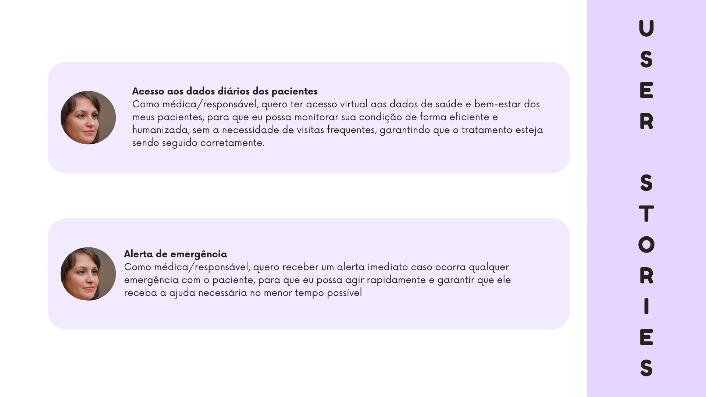

&emsp;&emsp;No desenvolvimento de produtos e serviços digitais, as **User Stories** (ou histórias de usuário) desempenham um papel crucial na criação de experiências que realmente atendem às necessidades e expectativas dos usuários. Uma user story é uma descrição simples e concisa de uma funcionalidade ou requisito a partir da perspectiva do usuário final e seu formato ajuda a equipe de desenvolvimento a entender não apenas o que precisa ser feito, mas **por que** aquilo é importante para o usuário.

&emsp;&emsp;A importância das user stories consiste em sua capacidade de conectar diretamente as necessidades dos usuários com as soluções que estão sendo construídas. Elas guiam o design e o desenvolvimento, garantindo que as funcionalidades entregues sejam úteis, intuitivas e centradas no usuário. Com base nas personas definidas para o projeto, é possível explorar as user stories associadas a cada uma delas a seguir.

### Adalberto

 Figura 1 - User Stories do Adalberto 

Fonte: Elaborado pela equipe J.A.R.B.A.S.

### Márcia

 Figura 2 - User Stories da Márcia 

Fonte: Elaborado pela equipe J.A.R.B.A.S.

&emsp;&emsp;Com base nas User Stories apresentadas, é possível ter uma visão mais abrangente das funcionalidades que o sistema deve incluir para atender adequadamente os usuários que dele farão uso. É evidente a atenção que o robô deve ter na interação com Adalberto, a fim de oferecer funcionalidades de acompanhamento, enquanto mantém uma comunicação eficaz que não afaste o usuário da solução. Além disso, no que diz respeito à Márcia, destaca-se a importância de o sistema fornecer dados claros sobre seus pacientes de maneira contínua e ágil.