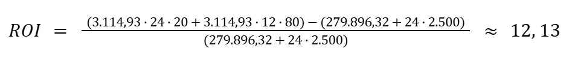

# Análise financeira

&emsp;&emsp;A presente seção discute a dimensão financeira da solução desenvolvida pela equipe J.A.R.B.A.S., tratando de custos envolvidos tanto no desenvolvimento e na operação do produto. 

&emsp;&emsp;O modelo de negócios idealizado pela equipe é B2B (Business to Business), o que significa que, supondo que a equipe fosse uma startup, a solução desenvolvida seria vendida para outras empresas. Neste caso, a solução seria vendida para operadoras de plano de saúde, que são instituições que intermediam as operações financeiras entre beneficiários e instituições de saúde. Tais instituições, por sua vez, disponibilizaram a solução para os beneficiários idosos mediante necessidade e/ou vontade destes.

## Projeção de custos

&emsp;&emsp;À vista disso, para cada robô comprado pelas operadoras de plano de saúde, um valor periódico deveria ser pago por estas à startup da equipe. Tal valor foi definido considerando os custos de produção, infraestrutura e manutenção da solução, os quais são descritos detalhadamente a seguir, nas tabelas 1 e 2, supondo 4 meses para o desenvolvimento do MVP comercial do projeto.

Tabela 1 - Custos estimados de desenvolvimento da solução

| Custo | Quantidade | Tempo (meses) | Valor | Total | Fonte |
| :---- | :---- | :---- | :---- | :---- | :---- |
| Salário de desenvolvedor de software  | 2 | 4 | R$8.000,00/mês | R$64.000,00 | [GLASSDOOR](https://www.glassdoor.com.br/Sal%C3%A1rios/software-engineer-sal%C3%A1rio-SRCH_KO0,17.htm) |
| Salário de cientista de dados | 2 | 4 | R$8.000,00/mês | R$64.000,00 | [GLASSDOOR](https://www.glassdoor.com.br/Sal%C3%A1rios/cientista-de-dados-sal%C3%A1rio-SRCH_KO0,18.htm) |
| Salário de desenvolvedor de hardware | 3 | 4 | R$8.000,00/mês | R$96.000,00 | [GLASSDOOR](https://www.glassdoor.com.br/Sal%C3%A1rios/hardware-engineer-sal%C3%A1rio-SRCH_KO0,17.htm) |
| Salário de coordenador de projetos | 1 | 4 | R$8.000,00/mês	 | R$32.000,00 | [GLASSDOOR](https://www.glassdoor.com.br/Sal%C3%A1rios/coordenador-de-projetos-sal%C3%A1rio-SRCH_KO0,23.htm) |
| Mensalidade do Watson X | 1 | 4 | R$5.974,08/mês | R$23.896,32 | [IBM](https://www.ibm.com/br-pt/watsonx/pricing) |

Fonte: Elaborado pela equipe J.A.R.B.A.S.

&emsp;&emsp;Somando, os custos relacionados à produção totalizam **R$279.896,32**. Deve-se ressaltar que todos os valores de salário listados na tabela 1 estão próximos das médias salariais que constam em cada uma das fontes, apesar de não serem exatamente iguais à média salarial, uma vez que, como startup, a equipe J.A.R.B.A.S. teria liberdade para regular a quantia destinada ao salário de cada profissional. 

Tabela 2 - Custos estimados de infraestrutura e operação da solução

| Custo | Valor | Total | Fonte |
| :---- | :---- | :---- | :---- |
| Deploy e manutenção do servidor e sua infraestrutura | R$2.500/mês | N/A | [AWS](https://aws.amazon.com/pt/pricing/) |
| Fabricação do robô | R$50.000/unidade | N/A | [QViro](https://qviro.com/blog/how-much-does-a-humanoid-robot-cost/) |

Fonte: Elaborado pela equipe J.A.R.B.A.S.

&emsp;&emsp;Os custos estimados referentes à infraestrutura e à operação da solução, por sua vez, não podem ser simplesmente somados para se obter uma visão total de valores, uma vez que estes variam de acordo com o tempo de operação da solução e da quantidade de robôs vendidos.

## Cáculo da mensalidade

&emsp;&emsp;Diante do exposto, o cálculo do valor da mensalidade paga pelas operadoras de plano de saúde para adquirir a solução compreende que, após os 4 meses de desenvolvimento, o produto passe a ser comercializado e o faturamento mínimo necessário para cobrir os custos de desenvolvimento e de infraestrutura seria dado por:

> Faturamento mínimo = 279.896,32 + 2.500 x Q + 50.000 x R

&emsp;&emsp;Neste caso, Q é o número de meses no qual espera-se obter o faturamento mínimo e R é a quantidade de robôs que espera-se colocar em funcionamento neste mesmo período. Supondo que **Q = 24 (2 anos)** e **R = 100**, o faturamento mínimo seria igual a **R$5.339.896,32**. Esperando-se um lucro de **40%** em cima desse valor, o faturamento ideal seria dado por:

> **Faturamento ideal** = 5.339.896,32 x 1,4 = **R$7.475.854,85**

&emsp;&emsp;Portanto, a média do faturamento mensal ideal para os dois primeiros anos de atividade da solução seria igual a:

> **Média do faturamento mensal ideal** = 7.475.854,85 / 24 = **R$311.493,95**

&emsp;&emsp;Logo, é possível obter o valor mensal ideal a ser cobrado dos consumidores da solução nesses dois primeiros iniciais para cada unidade de robô:

> **Valor mensal ideal** = 311.493,95 / 100 = **R$3.114,93**

## Cálculo do ROI

&emsp;&emsp;Com base nesses valores, é possível calcular o ROI (Return On Investment) do modelo de negócios da solução. O ROI é uma métrica que permite verificar previamente o impacto financeiro de um investimento e, portanto, obter uma melhor noção sobre a viabilidade financeira do projeto desenvolvido pela equipe J.A.R.B.A.S. Portanto, tal métrica foi calculada seguindo a fórmula estabelecida na imagem 1, a seguir:

Imagem 1 - Fórmula para cálculo do ROI (Return On Investment)

  

Fonte: [Blog Surfe Digital](https://www.surfedigital.io/blog/roi)

&emsp;&emsp;Aplicando os valores específicos da solução, levando-se em consideração um período de 2 anos a partir do início da operação comercial do produto com as condições previstas na [análise de tamanho de mercado](./analise_tamanho_mercado.md), obtém-se:

Imagem 2 - Cálculo do ROI da solução

Fonte: Elaborado pela equipe J.A.R.B.A.S.

&emsp;&emsp;O resultado de 12,13 indica que o retorno sobre o valor de investimento de desenvolvimento e manutenção da solução seria de 12,13 vezes esse mesmo valor. Portanto, conclui-se que o investimento na solução J.A.R.B.A.S., mediante as circunstâncias previstas, seria viável e apresentaria um retorno positivo significativo.