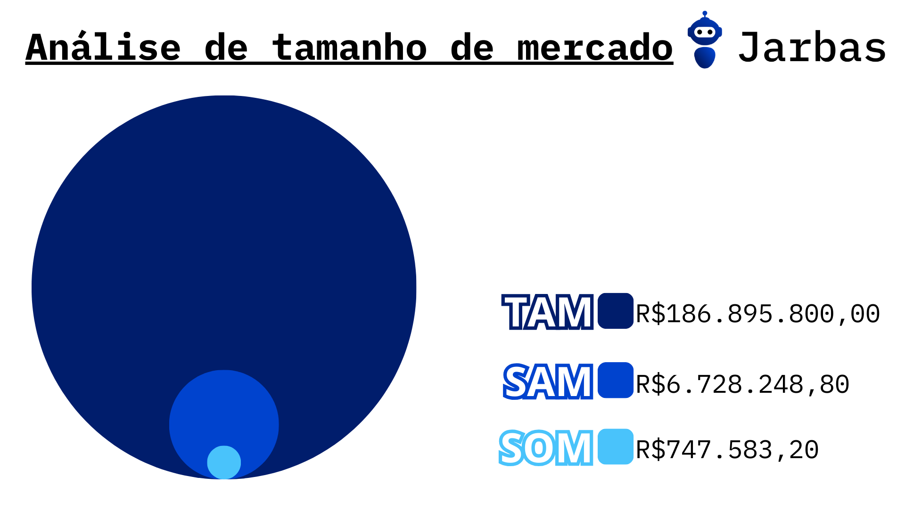

# Análise de tamanho de mercado

&emsp;&emsp;A análise discutida na presente seção é um tipo de análise de negócios que possibilita visualizar o tamanho do mercado disponível para um determinado produto ou serviço de vários ângulos. Isto é, com base nas métricas TAM, SAM e SOM, pode-se entender como o mercado se encontra em um estado inicial e qual poderá ser seu tamanho dentro de um espaço de tempo. Dessa forma, é possível avaliar o quão escalável e viável o projeto é em relação à sua geração de receita.

&emsp;&emsp;Com base nisso, a equipe J.A.R.B.A.S. elaborou uma análise do tipo sobre a solução desenvolvida, cujas conclusões estão ilustradas na figura 1, a seguir. 

Figura 1 - Análise de tamanho de mercado (TAM, SAM e SOM) da solução J.A.R.B.A.S.

  

Fonte: Elaborado pela equipe J.A.R.B.A.S.

&emsp;&emsp;Os valores de cada uma das métricas foram obtidos a partir do valor mensal que seria cobrado sobre cada robô para cada plano de saúde (R$3.114,93, como estabelecido na [análise financeira](./analise_financeira.md)), seguindo a lógica de cálculo definida na tabela 1, a seguir.

Tabela 1 - Lógica para cálculo das métricas de TAM, SAM e SOM

| Métrica | Descrição | Lógica de cálculo |
| :---- | :---- | :---- |
| TAM (Total Available Market) | Valor de receita com potencial para ser gerada a longo prazo, considerando um cenário completamente ideal. | Receita obtida a partir da venda e manutenção do serviço de 1000 robôs por 5 anos.  |
| SAM (Serviceable Available Market) | Valor de receita com potencial para ser gerada em curto-médio prazo, considerando um cenário real. | Receita obtida a partir da venda de 20 robôs no 1º ano de funcionamento e a partir da venda de mais 80 robôs no 2º ano de funcionamento, levando em consideração custos de manutenção e infraestrutura mensais. |
| SOM (Serviceable Obtainable Market) | Valor de receita com potencial para ser gerada em curto prazo, considerando um cenário real. | Receita obtida a partir da venda de 20 robôs no 1º ano de funcionamento da solução, levando em consideração custos de manutenção e infraestrutura mensais. |

Fonte: Elaborado pela equipe J.A.R.B.A.S.

&emsp;&emsp;Como se observa, a métrica de TAM apresenta um valor expressivamente maior em relação às métricas de SAM e SOM, o que está dentro do esperado para uma empresa que irá iniciar sua operação. Contudo, com o amadurecimento do produto, é possível tanto que a métrica de SOM se aproxime da métrica de SAM (simbolizando o alcance do mercado já previsto como alcançável) quanto que ambas se aproximem da métrica de TAM (o que demonstraria o alcance de um mercado não previsto como atingível e, consequentemente, um modelo de negócios bem sucedido para a solução).  

&emsp;&emsp;Diante do exposto, para que tal cenário seja alcançado pela equipe J.A.R.B.A.S. num contexto de aplicação comercial real do projeto, é necessário que o modelo de negócios seja sustentável e escalável. Por isso, é relevante focar em estratégias como focar na consolidação de uma boa imagem nos primeiros anos de operação e buscar vender o produto para operadoras de plano de saúde de cultura inovadora antes das mais tradicionais.