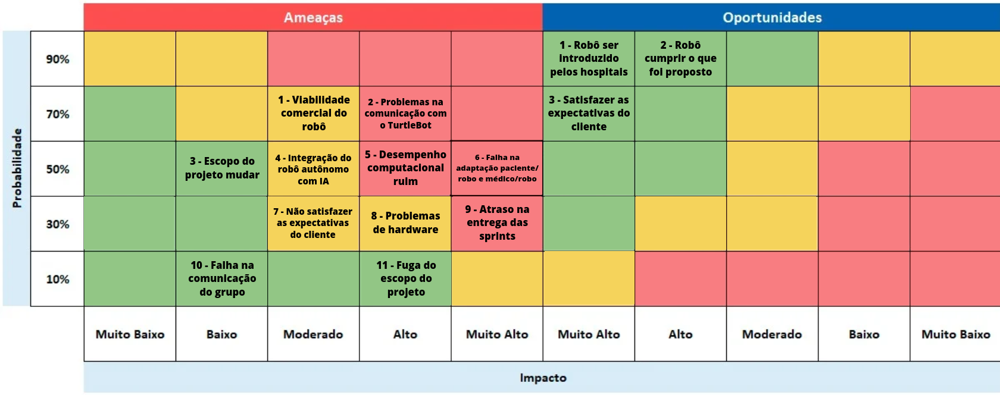

# Matriz de Riscos
A matriz de riscos é uma ferramenta fundamental na gestão de projetos, projetada para identificar, categorizar e gerenciar riscos potenciais ao longo de todo o projeto. Com a flexibilidade para se ajustar conforme novos eventos surgem, ela ajuda a visualizar a probabilidade e o impacto de cada risco, facilitando a priorização de ações de mitigação. Além de abordar os riscos, a matriz também considera oportunidades que podem aumentar o valor do projeto, permitindo uma abordagem mais estratégica.

**OBS: Todos os itens dispostos na matriz de risco vão estar descritos logo abaixo para melhor compreensão de onde pode-se encontrar os verdadeiros riscos/oportunidades e como mitigalos/potencializa-los**

 Figura 1 - Matriz de Riscos 

Fonte: Elaborado pela equipe J.A.R.B.A.S.

# Entendendo as ameaças e as oportunidades da matriz de risco

## Ameaças

**1 - Viabilidade comercial do robo:** A viabilidade comercial do robô é um risco importante, pois envolve a aceitação do mercado e a relação custo-benefício do produto. O desenvolvimento de um robô autônomo com inteligência artificial para monitoramento de pacientes requer investimentos significativos em tecnologia, hardware, software e validação clínica. Se o custo do produto final for muito alto ou se os benefícios não forem suficientemente claros para os stakeholders, pode haver dificuldade em alcançar aceitação no mercado. Esse risco também inclui a necessidade de garantir que o produto seja competitivo em relação a soluções similares e que possa ser escalável para diferentes ambientes de saúde, como hospitais e residências assistidas.

**2 - Problemas na comunicação com o turtlebot:** A comunicação entre o software e o hardware do TurtleBot3 é um fator crítico para o sucesso do projeto. Qualquer falha ou instabilidade nessa comunicação pode comprometer a capacidade do robô de operar de forma eficiente, especialmente em tarefas de monitoramento de saúde e respostas a emergências. Esse risco inclui problemas como perda de conexão, latência de resposta, falhas na integração de sensores ou comandos de voz, que podem afetar diretamente a precisão das interações do robô com os pacientes.

**3 - Escopo do projeto mudar:** Mudanças no escopo do projeto podem acontecer devido a diversas razões, como novas necessidades identificadas pelo cliente, feedback dos usuários, ou descobertas durante o desenvolvimento do protótipo. Essa mudança pode impactar prazos, recursos e até a viabilidade do projeto. Por se tratar de uma prova de conceito (POC), é comum que ajustes sejam necessários para adaptar a solução aos requisitos reais dos usuários e do mercado. O desafio é manter o controle dessas mudanças para que não comprometam a entrega final.

**4 - Integração do robô autônomo com IA:** A integração da inteligência artificial ao robô é um dos elementos mais complexos do projeto. O sucesso dessa integração depende da precisão e eficiência dos algoritmos de IA que gerenciam o monitoramento dos sinais vitais, as interações verbais e as respostas a emergências. Qualquer falha nesse componente pode resultar em respostas inadequadas ou atrasadas em situações críticas. Além disso, o robô precisa ser capaz de aprender e adaptar seu comportamento com base na interação com os pacientes e nos dados coletados, o que exige uma IA robusta e confiável.

**5 - Desempenho computacional ruim:** O desempenho computacional é fundamental para garantir que o robô opere em tempo real, especialmente em tarefas críticas como monitoramento de saúde e emissão de alertas de emergência. Se o robô não tiver poder computacional suficiente ou se os algoritmos de processamento de dados forem ineficientes, isso pode causar atrasos nas respostas e comprometer a eficácia do sistema. Esse risco precisa ser mitigado com otimização de software, uso de hardware adequado e testes extensivos para identificar gargalos de desempenho.

**6 - falha na adaptação paciente/robo e médico/robo:** A aceitação e adaptação dos pacientes e profissionais de saúde ao robô são cruciais para o sucesso do projeto. Se os pacientes não se sentirem confortáveis ou seguros em interagir com o robô, ou se os profissionais de saúde não confiarem no sistema para delegar tarefas importantes, a utilidade do robô será significativamente reduzida. Esse risco está relacionado tanto ao design da interface do robô quanto à forma como ele se comunica e responde às necessidades dos usuários, sendo essencial desenvolver um sistema intuitivo e acessível.

**7 - Não satisfazer as expectativas do cliente:** Este risco se refere à possibilidade de o robô autônomo não atender plenamente às expectativas dos stakeholders, como pacientes, profissionais de saúde e a IBM, parceira do projeto. As expectativas podem variar desde a funcionalidade do robô até a confiabilidade e eficiência das respostas em situações críticas. Para minimizar esse risco, é importante estabelecer um canal de comunicação claro com os stakeholders, gerenciar as expectativas desde o início e incorporar feedback durante o desenvolvimento da prova de conceito.

**8 - Problemas de hardware:** Problemas de hardware podem incluir falhas nos sensores do TurtleBot3, mau funcionamento de componentes eletrônicos, dificuldades com a bateria ou problemas de conectividade e o principal, problema com o sensor LIDAR que é o que a gente vai focar nesse módulo. Qualquer uma dessas falhas pode comprometer o desempenho do robô e sua capacidade de realizar tarefas críticas, como monitoramento de saúde ou envio de alertas em caso de emergência. É necessário realizar testes rigorosos do hardware e manter um plano de manutenção preventiva para minimizar esses problemas.

**9 - Atraso na entrega das sprints:** Atrasos na entrega das sprints podem ocorrer devido a vários fatores, como desafios técnicos, problemas na integração do sistema ou dificuldades no desenvolvimento do software. Como esse projeto envolve diversas camadas de complexidade — desde IA e hardware até software de comunicação e interação — é crucial manter uma gestão ágil e eficiente para garantir que as sprints sejam entregues conforme o cronograma planejado, evitando atrasos que possam comprometer a entrega final.

**10 - Falha na comunicação do grupo:** Uma falha na comunicação dentro da equipe de desenvolvimento pode levar a mal-entendidos, falta de alinhamento nos objetivos e uma execução descoordenada do projeto. A colaboração efetiva é essencial para o sucesso de projetos complexos como este, onde cada membro da equipe precisa estar ciente das responsabilidades e prazos dos outros. É importante estabelecer uma comunicação clara e frequente, com atualizações regulares sobre o progresso e os desafios enfrentados.

**11 - Fuga do escopo do projeto:** A fuga do escopo ocorre quando o projeto começa a incluir funcionalidades ou mudanças que não foram originalmente planejadas, o que pode levar a um aumento de custos, atrasos e comprometimento da qualidade do produto final. Para evitar isso, é importante documentar bem o escopo do projeto desde o início, implementar controles de mudanças rigorosos e garantir que qualquer alteração seja analisada e aprovada de acordo com a viabilidade e os objetivos do projeto.

## Oportunidades

**1 - Robô ser introduzido pelos hospitais:** Uma das maiores oportunidades do projeto é a introdução do robô em hospitais e outros ambientes de saúde. Se o robô autônomo demonstrar eficiência e confiabilidade durante a prova de conceito, ele poderá ser adotado por instituições de saúde para apoiar profissionais e melhorar o cuidado aos pacientes. Essa oportunidade está alinhada com a necessidade crescente de automação e inovação no setor de saúde, especialmente em tarefas rotineiras que consomem tempo e recursos. A aceitação pelo mercado de saúde pode abrir portas para novas colaborações e desenvolvimentos futuros, ampliando a presença do robô em clínicas, lares de idosos e residências assistidas.

**2 - Robô cumprir o que foi proposto:** Cumprir com sucesso os objetivos propostos pelo projeto é uma oportunidade para demonstrar o valor real do robô autônomo como uma solução inovadora e eficaz no cuidado de pacientes. Se o robô conseguir realizar tarefas como lembretes de medicação, monitoramento de sinais vitais e emissão de alertas de emergência de forma eficiente, ele pode estabelecer um novo padrão de assistência tecnológica no setor de saúde. Além disso, alcançar esses objetivos reforça a credibilidade do projeto e valida o investimento em tecnologias como inteligência artificial e robótica, que são fundamentais para enfrentar os desafios de um sistema de saúde sobrecarregado.

**3 - Satisfazer as expectativas do cliente:** Satisfazer as expectativas dos clientes, incluindo os stakeholders e a parceira IBM, é uma oportunidade essencial para fortalecer relacionamentos e criar uma base sólida para futuros projetos. Quando o robô atende ou supera as expectativas, ele não só demonstra sua eficácia e confiabilidade, mas também aumenta a confiança dos usuários em soluções tecnológicas para o cuidado de pacientes. O sucesso do projeto pode levar a um aumento no interesse de outras instituições de saúde e empresas tecnológicas, incentivando novas oportunidades de mercado, parcerias estratégicas e até mesmo novos desenvolvimentos baseados na experiência adquirida com essa prova de conceito.

# Planos de Prevenção e Ataque
&emsp; Além da criação da Matriz de Risco, também é desenvolvido um plano de prevenção para evitar que os riscos se concretizem, bem como um plano de ação para lidar com os riscos caso eles se tornem realidade.

1. Viabilidade comercial do robô (Jarbinhas)

    **Prevenção:** Realizar estudos de mercado para entender a aceitação do robô em ambientes de saúde e identificar os requisitos mínimos para que ele seja comercialmente viável. Engajar potenciais usuários finais e stakeholders no desenvolvimento, garantindo que suas necessidades sejam consideradas desde o início.

    **Ataque:** Se a viabilidade comercial do robô for questionada, ajustar a estratégia de marketing para destacar os benefícios do robô em termos de redução de custos e aumento da eficiência no atendimento de saúde, utilizando dados concretos de estudos e feedback de usuários.

2. Problemas na comunicação com o TurtleBot

    **Prevenção:** Implementar uma fase de testes robusta para validar a comunicação entre o TurtleBot e os sistemas de controle, assegurando que todas as interfaces estejam devidamente configuradas e funcionais. Documentar claramente todos os protocolos e configurações de comunicação.

    **Ataque:** Se ocorrerem problemas de comunicação, mobilizar rapidamente a equipe de desenvolvimento para identificar e corrigir a falha, realizando testes de regressão para garantir que não haja impacto em outras funcionalidades do robô.

3. Escopo do projeto mudar

    **Prevenção:** Alinhar desde o início com a IBM e demais stakeholders as expectativas e limitações do projeto, destacando que se trata de uma prova de conceito (POC) e que mudanças no escopo podem impactar prazos e recursos.
    
    **Ataque:** Se o escopo mudar, renegociar prazos e recursos com todos os envolvidos e adaptar o planejamento para acomodar os novos requisitos sem comprometer a qualidade do projeto.

4. Integração do robô autônomo com IA

    **Prevenção:** Planejar a arquitetura do sistema de IA com foco na modularidade para facilitar a integração com o robô e realizar testes de compatibilidade antes da implementação completa.

    **Ataque:** Se houver falhas na integração, priorizar uma análise rápida dos módulos que apresentam problemas e considerar a utilização de APIs de terceiros ou soluções alternativas para conectar a IA ao robô.

5. Desempenho computacional ruim

    **Prevenção:** Escolher componentes de hardware adequados e realizar otimizações de código desde o início para garantir que o robô tenha capacidade computacional suficiente para executar as tarefas em tempo real.
    
    **Ataque:** Caso o desempenho computacional seja insuficiente, ajustar a carga de processamento distribuindo tarefas para sistemas externos ou escalando o hardware utilizado, conforme necessário.

6. Falha na adaptação paciente/robô e médico/robô

    **Prevenção:** Realizar workshops e sessões de treinamento com profissionais de saúde e pacientes para garantir que todos estejam confortáveis e saibam como interagir com o robô.
    
    **Ataque:** Se a adaptação for um problema, coletar feedback detalhado dos usuários e fazer ajustes na interface e nas funcionalidades do robô para torná-lo mais intuitivo e amigável.

7. Não satisfazer as expectativas do cliente

    **Prevenção:** Manter uma comunicação constante e transparente com a IBM e outros stakeholders, realizando revisões periódicas do projeto para alinhar as entregas às expectativas do cliente.
    
    **Ataque:** Se as expectativas não forem atendidas, organizar reuniões para realinhar objetivos e identificar rapidamente as áreas de insatisfação, ajustando o projeto de acordo com as necessidades do cliente.

8. Problemas de hardware

    **Prevenção:** Selecionar componentes de hardware de alta qualidade e realizar testes rigorosos de durabilidade e desempenho antes de integrá-los ao robô.
    
    **Ataque:** Se problemas de hardware surgirem, ativar um plano de contingência que inclui a troca rápida de peças e a implementação de redundâncias para minimizar o impacto nas operações do robô.

9. Atraso na entrega das sprints

    **Prevenção:** Definir metas realistas para cada sprint e monitorar o progresso semanalmente, ajustando as tarefas conforme necessário para manter o cronograma.
    
    **Ataque:** Em caso de atraso, reorganizar o backlog para priorizar as entregas mais críticas e alocar recursos adicionais para acelerar o desenvolvimento nas áreas que estão mais atrasadas.

10. Falha na comunicação do grupo

    **Prevenção:** Estabelecer canais de comunicação claros e frequentes, além de reuniões regulares para manter todos os membros da equipe alinhados com os objetivos e progressos do projeto.
    
    **Ataque:** Se ocorrer uma falha na comunicação, convocar uma reunião imediata para resolver mal-entendidos e redefinir as responsabilidades e canais de comunicação para evitar novas falhas.

11. Fuga do escopo do projeto

    **Prevenção:** Documentar detalhadamente o escopo do projeto e revisá-lo regularmente com a equipe para garantir que todas as atividades estejam alinhadas com os objetivos propostos.
    
    **Ataque:** Se houver uma fuga do escopo, reavaliar imediatamente as prioridades e ajustar os recursos e prazos, mantendo o foco nos principais objetivos do projeto para evitar desvios adicionais.

# Referências 
[1] REDACAO PAPOCA. O que é matriz de risco? Aprenda como montar + exemplo. Esfera Energia. Disponível em: [https://blog.esferaenergia.com.br/gestao-empresarial/matriz-de-risco](https://blog.esferaenergia.com.br/gestao-empresarial/matriz-de-risco). Acesso em: 08 agosto. 2024.