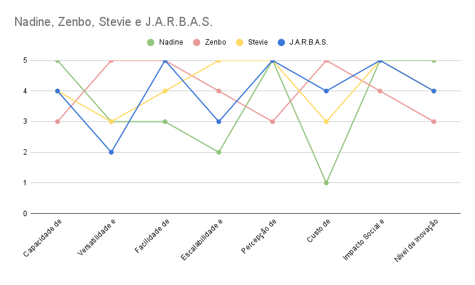
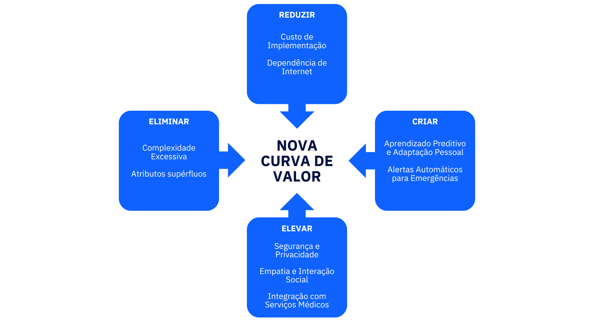

# Matriz de Avaliação de Valor Oceano Azul

&emsp;&emsp;A matriz de avaliação de Oceano Azul é uma ferramenta estratégica utilizada para identificar oportunidades de inovação em mercados saturados, incentivando a criação de novos espaços de mercado com menor concorrência. A ideia é que, ao invés de competir em mercados já estabelecidos e disputados ("oceanos vermelhos"), as empresas possam desenvolver novas propostas de valor que atraiam consumidores por caminhos inexplorados ("oceanos azuis").

&emsp;&emsp;Também, a matriz orienta a reavaliação dos atributos de um setor, buscando eliminar características obsoletas, reduzir elementos pouco relevantes, elevar o nível de certos aspectos valorizados e criar novos elementos que nunca foram oferecidos. Esse processo permite que empresas se diferenciem e criem demanda, aumentando a competitividade de forma sustentável e garantindo uma vantagem única no mercado.

 Figura 1 - Gráfico de Avaliação 

Fonte: Elaborado pela equipe J.A.R.B.A.S.

### 1. Capacidade de Interação Humana

&emsp;&emsp;Esta dimensão avalia a capacidade do robô de se comunicar e interagir com humanos de forma eficaz.

- Nadine (5): Projetada como um robô humanoide altamente interativo, a Nadine simula expressões e emoções humanas, reconhecendo rostos e respondendo a diálogos complexos. Isso a torna extremamente eficaz em ambientes que demandam interação natural.

- Zenbo (3): Embora interaja bem, o Zenbo oferece funcionalidades mais básicas, como respostas por comando de voz, sendo voltado para o entretenimento familiar e automação doméstica.

- Stevie (4): Desenvolvido para lares de idosos, Stevie foca em interações amigáveis e úteis para assistência, mas suas capacidades são mais simples que as da Nadine.

- J.A.R.B.A.S. (4): O J.A.R.B.A.S. apresenta uma interação relativamente boa em termos de comunicação e conversação com o usuário, oferecendo suporte emocional e funcional. No entanto, não alcança o mesmo nível de naturalidade que robôs mais avançados em interação, como Nadine.

### 2. Versatilidade e Funções Adicionais

&emsp;&emsp;Avalia o quão bem o robô pode ser usado em diferentes cenários e com quais funcionalidades adicionais ele vem equipado.

- Nadine (3): Tem uma aplicação mais especializada, limitada a pesquisas, exposições, e interações sociais controladas. Não oferece funcionalidades adicionais além de sua capacidade de interação.

- Zenbo (5): Versátil e multifuncional, Zenbo pode controlar dispositivos domésticos, fornecer segurança, entreter e atuar como assistente educacional.

- Stevie (3): Embora eficiente em ambientes assistenciais, é menos versátil em outros contextos e não é projetado para funções fora desse nicho.

- J.A.R.B.A.S. (2): A solução foi desenvolvida com um foco específico em atender idosos, ou seja, nichada para um caso de uso particular. Essa escolha limita a versatilidade em comparação a Zenbo, que possui funcionalidades amplas para diversas aplicações.

### 3. Facilidade de Integração

&emsp;&emsp;Avalia quão fácil é integrar o robô a sistemas existentes, como IoT e software de gerenciamento.

- Nadine (3): Sua tecnologia avançada e especialização em interação humana tornam a integração em sistemas comerciais mais difícil e custosa.

- Zenbo (5): Feito para integração com dispositivos IoT e sistemas inteligentes, Zenbo se conecta facilmente a dispositivos domésticos e plataformas digitais.

- Stevie (4): Embora não tão fluido quanto o Zenbo, Stevie é projetado para ser integrado a sistemas hospitalares e assistenciais com relativa facilidade.

- J.A.R.B.A.S. (5): A integração foi um ponto forte no projeto, com uma arquitetura que favorece fácil conexão aos sistemas de saúde e manutenção contínua. Esse diferencial coloca J.A.R.B.A.S. em uma posição superior a outros robôs, como Nadine, na questão da integração.

### 4. Escalabilidade e Adaptabilidade

&emsp;&emsp;Avalia a capacidade do robô de se adaptar a diferentes ambientes e de ser utilizado em escala maior.

- Nadine (2): A Nadine é altamente especializada, o que limita sua aplicação e escalabilidade. Seu design focado em interação humana a torna difícil de adaptar para outros contextos.

- Zenbo (4): Pode ser facilmente adaptado para diferentes usos domésticos e educacionais, mas pode não ser escalável para aplicações mais complexas, como operações industriais.

- Stevie (5): Projetado para ser escalado em diferentes instituições de assistência e adaptado conforme necessário, Stevie é altamente versátil nesse quesito.

- J.A.R.B.A.S. (3): A falta de intenção de expandir para outros cenários de uso além do cuidado com idosos impacta a nota de escalabilidade. Assim, embora o projeto seja adaptado para o público-alvo, ele não possui a flexibilidade necessária para diferentes cenários.

### 5. Percepção de Segurança e Privacidade

&emsp;&emsp;Avalia o quanto o robô é seguro em termos de privacidade e proteção de dados.

- Nadine (5): Desenvolvida com forte ênfase em ética e segurança, respeitando as diretrizes de privacidade em ambientes controlados de pesquisa e interação social.

- Zenbo (3): Como é conectado à internet e a dispositivos domésticos, Zenbo levanta preocupações sobre privacidade e segurança, especialmente em ambientes residenciais.

- Stevie (5): Por ser utilizado em ambientes sensíveis, como lares de idosos e hospitais, o robô foi projetado com protocolos robustos de segurança e privacidade.

- J.A.R.B.A.S. (5): Pensando na solução completa, e não na POC que está sendo desenvolvida, o projeto tem a projeção de seguir rigorosamente a LGPD (Lei Geral de Proteção de Dados), a fim de garantir um alto nível de segurança e privacidade dos dados de seus usuários, algo essencial para seu público-alvo e a parceria com sistemas de saúde.

### 6. Custo de Implementação

&emsp;&emsp;Avalia o custo envolvido na implementação do robô.

- Nadine (1): Com um custo superior a 20 mil dólares, a Nadine é extremamente cara e inviável para a maioria dos ambientes operacionais e comerciais.

- Zenbo (5): Com preço acessível (R$ 2.400 / ~470 dólares), é uma opção viável para consumidores individuais e pequenas instituições.

- Stevie (3): Com preço entre 5.000 e 10.000 dólares, é adequado para instituições, mas pode não ser acessível para consumidores comuns.

- J.A.R.B.A.S. (4): Embora o custo de implementação seja alto - não tão alto quanto a Nadine, por exemplo -, ele é mitigado pelo modelo de parceria B2B com planos de saúde, que mantém a solução viável para as operadoras de saúde e acessível para os usuários finais.

### 7. Impacto Social e Qualidade de Vida

&emsp;&emsp;Avalia como o robô pode melhorar a qualidade de vida e o impacto que gera na sociedade.

- Nadine (5): Traz impacto significativo para pesquisa e setores que buscam aprimorar o bem-estar emocional e social por meio de robótica social avançada.

- Zenbo (4): Contribui para melhorar a segurança e conforto em residências, mas seu impacto social é limitado ao contexto familiar.

- Stevie (5): Tem um impacto significativo em ambientes assistenciais, melhorando a vida de idosos e pacientes por meio de monitoramento e assistência ativa.

- J.A.R.B.A.S. (5): A solução tem um impacto positivo direto na vida dos idosos, proporcionando segurança, monitoramento - sem interferir na autonomia do idoso - e companhia, o que eleva significativamente a percepção de valor social do projeto.

### 8. Nível de Inovação

&emsp;&emsp;Avalia o grau de inovação presente na concepção e nas funcionalidades do robô.

- Nadine (5): Um dos robôs mais inovadores, combinando IA avançada com interação social e comportamentos humanizados.

- Zenbo (3): Embora inovador no mercado doméstico, não apresenta o nível de inovação tecnológica da Nadine.

- Stevie (4): Inovador por aplicar tecnologias emergentes em um contexto de assistência social e cuidados com a saúde.

- J.A.R.B.A.S. (4): Embora o projeto tenha diferenciais inovadores, como a aplicação focada em idosos e integração com saúde, ele não se destaca tanto quanto Nadine na inovação pura, ficando em um patamar intermediário.

 Figura 2 - Matriz das Quatro Ações 

Fonte: Elaborado pela equipe J.A.R.B.A.S.

1. **Eliminar**
- Complexidade desnecessária em funções de entretenimento: Como o foco de J.A.R.B.A.S. é o auxílio a idosos, funções puramente recreativas (como as oferecidas por Zenbo) podem ser eliminadas para simplificar o design e reduzir custos.

2. **Reduzir**
- Custo de Implementação: Embora J.A.R.B.A.S. precise de IA e sensores avançados, é essencial buscar componentes acessíveis ou parcerias para reduzir o custo sem comprometer a funcionalidade essencial.

- Nível de Interação Avançada: Interação humana extremamente sofisticada (como a de Nadine) pode ser reduzida, focando apenas no necessário para acompanhar e prestar suporte emocional e funcional aos idosos.

3. **Elevar**
- Segurança e privacidade dos dados: Como J.A.R.B.A.S. lida com informações sensíveis de saúde e localização, é essencial garantir padrões elevados de segurança e proteção de dados, elevando essa característica a um nível crítico.

- Facilidade de integração: Melhorar a capacidade de J.A.R.B.A.S. para se integrar com sistemas de saúde e plataformas de IoT, permitindo monitoramento remoto eficiente e comunicação rápida com familiares ou cuidadores.

4. **Criar**
- Monitoramento de saúde e alerta automático: Incluir funcionalidades inovadoras, como detecção de quedas, monitoramento de sinais vitais e alertas automáticos para emergências, que vão além do que os robôs comparados oferecem.

- Companhia personalizada: Desenvolver algoritmos que permitam uma interação mais personalizada, com base nos hábitos e preferências do usuário, para aumentar a sensação de acolhimento e bem-estar.

## Conclusão

&emsp;&emsp;Com base na comparação entre Nadine, Zenbo, Stevie e J.A.R.B.A.S., e ao aplicar a matriz das 4 Ações, pode-se concluir que J.A.R.B.A.S. tem um posicionamento claro voltado para o impacto social e a melhoria da qualidade de vida de idosos. Ele se diferencia dos outros robôs ao:

**Eliminar** distrações e complexidade excessiva que não agregam ao seu objetivo principal.

**Reduzir** custos e complexidade de interação, mantendo apenas o necessário para a convivência e segurança.

**Elevar** padrões de segurança e privacidade e melhorar a integração com serviços de saúde.

**Criar** funcionalidades inovadoras voltadas para monitoramento de saúde e companhia personalizada, o que o destaca no mercado.

&emsp;&emsp;Também, tendo como base nos critérios e notas atribuídas na matriz de avaliação de valor, o projeto J.A.R.B.A.S. demonstra um forte alinhamento com seus objetivos principais: melhorar a qualidade de vida e a segurança dos idosos. Seu foco específico em um nicho garante uma execução mais precisa, porém limita sua adaptabilidade e versatilidade. Ademais, a escolha por uma integração eficiente e compliance com a LGPD é um diferencial que amplia sua viabilidade no contexto de saúde.

&emsp;&emsp;Portanto, o J.A.R.B.A.S. se posiciona como uma solução inovadora e impactante para o público-alvo, mas com limitações estratégicas em termos de escalabilidade e funcionalidade adicional. Também, a parceria com planos de saúde B2B é essencial para garantir a sustentabilidade do projeto.