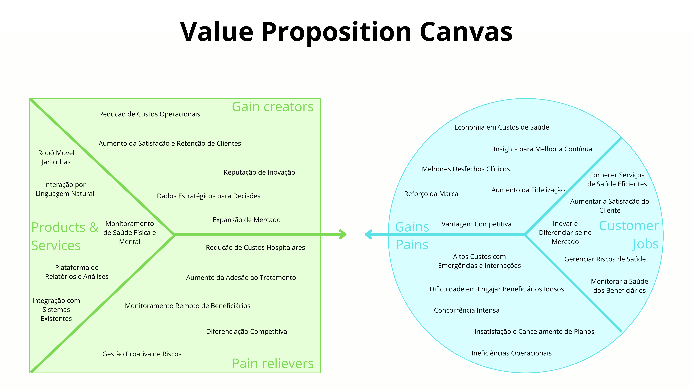

# **Canvas de Proposta de Valor**

## Introdução

&emsp;&emsp;O **Projeto J.A.R.B.A.S.** apresenta uma solução inovadora voltada para provedores de planos de saúde que buscam melhorar a qualidade dos serviços oferecidos aos seus beneficiários idosos. Trata-se de um robô móvel autônomo equipado com inteligência artificial, capaz de acompanhar os idosos em suas residências, se comumincar por meio de voz e monitorar sua saúde física e mental.

&emsp;&emsp;Ao proporcionar interação por meio de linguagem natural, o J.A.R.B.A.S. não apenas auxilia na prevenção de incidentes, mas também atua como companhia, reduzindo a solidão e coletando dados relevantes para a saúde dos beneficiários. Essa solução permite que as provedoras ofereçam um serviço diferenciado, agregando valor aos seus planos e fortalecendo a relação com seus clientes.

&emsp;&emsp;A seguir, apresentaremos o **Canvas de Proposta de Valor** do J.A.R.B.A.S., destacando como a solução atende às necessidades e desafios das provedoras de planos de saúde, aliviando suas dores e gerando ganhos significativos.

## Diagrama

Figura 1 - Canvas de Proposta de Valor do projeto para provedoras de planos de saúde

Fonte: Elaborado pela equipe J.A.R.B.A.S.

## Descrição

&emsp;&emsp;O **Canvas de Proposta de Valor** é uma ferramenta estratégica que permite alinhar os produtos e serviços oferecidos às necessidades dos clientes empresariais. Ele é composto por dois blocos principais:

- **Mapa de Valor**: Detalha os produtos e serviços, aliviadores de dores e criadores de ganhos que a solução oferece às provedoras de planos de saúde.
- **Perfil do Cliente**: Descreve as tarefas que as provedoras realizam, suas dores e os ganhos que esperam ao adotar a solução J.A.R.B.A.S..

## Mapa de Valor

### Produtos e Serviços

- **Robô Móvel Jarbinhas**: Um robô autônomo que acompanha beneficiários idosos em suas residências, fornecendo suporte e coleta de dados.
- **Interação por Linguagem Natural**: Comunicação por voz que facilita o engajamento dos beneficiários e a coleta de informações relevantes.
- **Monitoramento de Saúde Física e Mental**: Sensores integrados que coletam dados sobre sinais vitais e bem-estar psicológico dos beneficiários.
- **Plataforma de Relatórios e Análises**: Dashboard que fornece insights e relatórios detalhados para as provedoras, auxiliando na tomada de decisões.
- **Integração com Sistemas Existentes**: Compatibilidade com os sistemas de gestão já utilizados pelas provedoras de planos de saúde.

### Aliviadores de Dores

- **Redução de Custos Hospitalares**: Prevenção de incidentes que resultam em internações emergenciais e tratamentos de alto custo.
- **Aumento da Adesão ao Tratamento**: Lembretes e interações que garantem que os beneficiários sigam as prescrições médicas corretamente.
- **Monitoramento Remoto de Beneficiários**: Acompanhamento em tempo real sem a necessidade de visitas presenciais frequentes.
- **Diferenciação Competitiva**: Oferta de um serviço inovador que destaca a provedora no mercado e atrai novos clientes.
- **Gestão Proativa de Riscos**: Identificação antecipada de potenciais problemas de saúde, permitindo intervenções rápidas e eficazes.

### Criadores de Ganhos

- **Melhoria na Satisfação e Retenção de Clientes**: Beneficiários mais satisfeitos com os serviços, aumentando a fidelização.
- **Eficiência Operacional**: Otimização de recursos e processos, reduzindo despesas operacionais.
- **Dados Estratégicos para Decisões**: Informações detalhadas que auxiliam na gestão e na elaboração de políticas de saúde mais eficazes.
- **Fortalecimento da Marca**: Associação com tecnologia avançada e cuidados proativos eleva a reputação da provedora.
- **Expansão de Mercado**: Atração de novos clientes interessados em planos com benefícios diferenciados.

## Perfil do Cliente

### Tarefas dos Clientes (Provedoras de Planos de Saúde)

- **Fornecer Serviços de Saúde de Alta Qualidade**: Garantir que os beneficiários recebam cuidados eficientes e eficazes.
- **Monitorar a Saúde dos Beneficiários**: Acompanhar proativamente o bem-estar dos clientes para prevenir complicações.
- **Cumprir Exigências Regulamentares**: Atender às normas e legislações vigentes no setor de saúde.
- **Aumentar a Satisfação do Cliente**: Melhorar a experiência dos beneficiários para aumentar a fidelização.
- **Inovar e Diferenciar-se no Mercado**: Implementar soluções que destaquem a empresa perante a concorrência.
- **Gerenciar Riscos de Saúde**: Identificar e mitigar potenciais riscos à saúde dos beneficiários.

### Dores

- **Altos Custos com Emergências e Internações**: Gastos significativos decorrentes de eventos que poderiam ser evitados.
- **Dificuldade em Engajar Beneficiários Idosos**: Baixa adesão a tratamentos e recomendações médicas por parte dos idosos.
- **Concorrência Intensa**: Mercado saturado que exige diferenciação constante.
- **Risco de Perda de Clientes**: Insatisfação que pode levar ao cancelamento de planos.
- **Ineficiências Operacionais**: Desperdício de recursos por falta de processos proativos de cuidado.

### Ganhos

- **Redução de Custos Médicos**: Economia com a diminuição de procedimentos de alto custo e internações.
- **Melhores Desfechos Clínicos**: Beneficiários mais saudáveis e satisfeitos com o plano de saúde.
- **Aumento da Fidelização**: Clientes satisfeitos que permanecem mais tempo com a provedora.
- **Vantagem Competitiva**: Oferta de serviços diferenciados que atraem novos clientes.
- **Conformidade Regulamentar**: Alinhamento com as melhores práticas e normas do setor, evitando sanções.
- **Insights para Melhoria Contínua**: Uso de dados para otimizar serviços e estratégias de saúde.
- **Reforço da Marca**: Reconhecimento como líder em inovação e cuidado ao cliente.

## Conclusão

&emsp;&emsp;O **Canvas de Proposta de Valor** do Projeto J.A.R.B.A.S. demonstra claramente como a solução está alinhada às necessidades e desafios das provedoras de planos de saúde. Ao abordar diretamente suas dores e proporcionar ganhos significativos, o J.A.R.B.A.S. tem o potencial de ser uma ferramenta estratégica para as empresas do setor.

&emsp;&emsp;A implementação do J.A.R.B.A.S. nos planos de saúde permite que as provedoras ofereçam um serviço inovador e de alto valor agregado, melhorando a satisfação dos beneficiários, reduzindo custos operacionais e fortalecendo sua posição competitiva no mercado. Além disso, a solução contribui para a melhoria geral dos resultados de saúde dos clientes, promovendo um cuidado mais humano, eficiente e tecnológico.