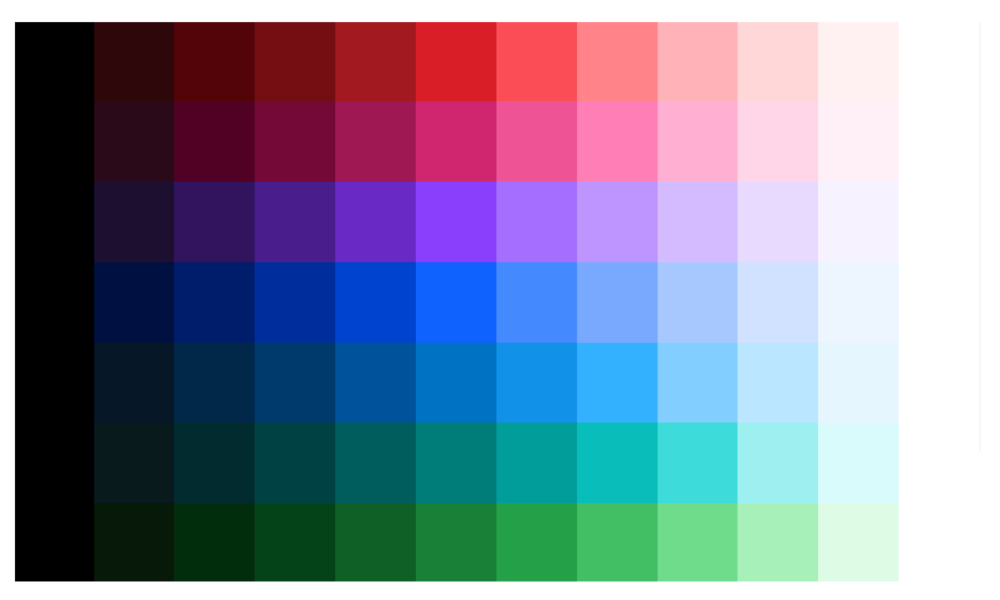
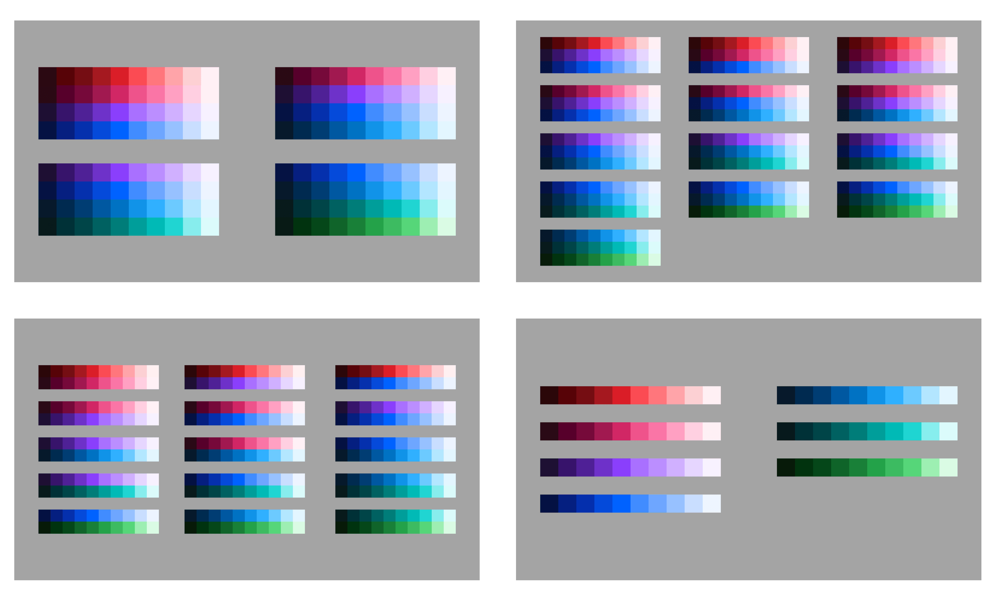

# Guia de Estilo

O Guia de Estilo desenvolvido para este projeto foi inspirado nas diretrizes visuais e de design da IBM, uma referência global em termos de design corporativo e experiência do usuário. O objetivo desse guia é garantir que o design do sistema siga padrões consistentes e coesos, promovendo uma experiência intuitiva, acessível e alinhada com as melhores práticas de mercado.

Com base nos princípios da IBM Design Language, que enfatizam clareza, simplicidade e usabilidade, o guia de estilo visa padronizar todos os aspectos visuais e funcionais da interface do usuário. As escolhas tipográficas, paleta de cores, ícones, componentes de UI, espaçamentos e elementos interativos foram definidos para refletir a identidade visual da IBM [disponível aqui](https://www.ibm.com/design/language/), criando uma experiência familiar e profissional para os usuários.

Este guia serve como uma referência crucial para todas os integrantes da equipe que está desenvolvendo o projeto, desde os designers até os desenvolvedores, garantindo que a visão do design seja implementada de forma consistente em todas as plataformas e dispositivos.

A seguir, apresentamos os principais elementos do nosso Guia de Estilo, detalhando as decisões tomadas e como elas foram adaptadas para este projeto, com base nos princípios da IBM e nas necessidades do público-alvo.

## Cores, combinação de cores e gradientes

### Paleta de Cores IBM

A paleta de cores adotada para este projeto segue os padrões da IBM, que são divididos em diferentes grupos para criar harmonia e equilíbrio visual. As cores foram escolhidas para transmitir profissionalismo e clareza, alinhando-se ao estilo corporativo e minimalista da IBM.

1. Tons de  Cinza

A paleta de tons de cinza é usada para elementos neutros e de fundo, ajudando a destacar as cores principais da interface. Esses tons variam desde o preto até o branco, oferecendo uma gama de opções para criar contraste e hierarquia visual sem distrair o usuário.

**Uso recomendado:** fundos, bordas e áreas secundárias.

 Figura 1 - Tons de Cinza 

Fonte: IBM Design.

2. Paleta Completa de Cores IBM

Essa é a paleta principal, que inclui uma variedade de cores, como vermelho, azul, verde e roxo, distribuídas em diferentes intensidades. Essa diversidade permite flexibilidade no design, oferecendo várias opções para destacar informações importantes ou criar diferenciação entre elementos.

**Uso recomendado:** botões, ícones, chamadas de ação e destaques visuais.

 Figura 2 - Paleta de Cores 

Fonte: IBM Design.

3. Paleta "Blue at the Core"

Esta paleta enfatiza tons de azul, mantendo uma identidade visual com foco em estabilidade e confiança. Essa variação de cores, com diferentes intensidades de azul, é ideal para criar uma base sólida e familiar no design.

**Uso recomendado:** branding principal, barras de navegação e cabeçalhos.

 Figura 3 - Tons de Azul 

Fonte: IBM Design.

### Combinação de Cores

Para garantir legibilidade e acessibilidade, o guia também define combinações recomendadas e as que devem ser evitadas. Abaixo, mostramos as combinações aprovadas, seguidas por combinações que comprometem a usabilidade.

- Combinações Recomendadas: Utilizam tons contrastantes entre fundo e texto, mantendo a interface visualmente agradável e de fácil leitura.

- Combinações a Evitar: Cores com pouco contraste, que podem comprometer a visibilidade e a experiência do usuário.

 Figura 4 - Combinação de Cores 

Fonte: IBM Design.

### Gradientes

Os gradientes são usados para adicionar profundidade e dinâmica à interface. Abaixo, estão os gradientes disponíveis, cada um feito para um propósito específico, seja para criar transições suaves entre elementos ou para destacar áreas de interesse.

- **Red to Magenta:** Ideal para chamadas de atenção.

- **Blue to Teal:** Para elementos de navegação.

- **Green to Cyan:** Para indicadores de sucesso ou finalização de tarefa.

## Tipografia

A escolha tipográfica do projeto segue a família de fontes IBM Plex, que foi desenhada para transmitir modernidade e inovação. Inspirada nos valores de clareza e funcionalidade, a tipografia IBM Plex equilibra a estética com a usabilidade, sendo ideal para projetos tecnológicos e de vanguarda. A combinação dessas fontes ajuda a construir uma identidade visual forte, mantendo a leitura acessível e clara em diversos contextos.

1. **Fonte Primária: IBM Plex Sans**

**Uso:** Cabeçalhos, títulos principais e textos de grande destaque.

**Descrição:** A IBM Plex Sans é uma fonte sem serifa que oferece um visual limpo e moderno. Sua simplicidade a torna ideal para transmitir inovação e tecnologia, além de garantir a legibilidade em telas de todos os tamanhos. Ela é usada em elementos de destaque, como cabeçalhos e títulos principais, para estabelecer a hierarquia visual da interface.

2. **Fonte Secundária: IBM Plex Mono**

**Uso:** Códigos, elementos técnicos e textos relacionados a dados ou instruções.

**Descrição:** A IBM Plex Mono é uma fonte monoespaçada que reforça o tema de tecnologia. Com um design que lembra a tipografia usada em editores de código, ela é ideal para exibir informações técnicas e blocos de código, proporcionando uma identidade visual alinhada ao conceito de inovação e precisão.

3. **Fonte Terciária: IBM Plex Serif**

**Uso:** Textos de corpo e parágrafos extensos, para conteúdos que demandam leitura contínua.

**Descrição:** A IBM Plex Serif acrescenta um toque de elegância e formalidade, equilibrando o estilo moderno das outras fontes. Com suas serifas sutis, ela melhora a legibilidade em blocos de texto maiores, tornando-se a escolha ideal para parágrafos e descrições detalhadas.

4. **Fonte Complementar: IBM Plex Condensed**

**Uso:** Subtítulos, legendas, rótulos e áreas onde o espaço é limitado.

**Descrição:** A IBM Plex Condensed é uma variação mais compacta, ideal para otimizar o uso do espaço sem perder legibilidade. Ela é utilizada para elementos menores, como legendas e rótulos, permitindo uma apresentação organizada e funcional em espaços reduzidos.