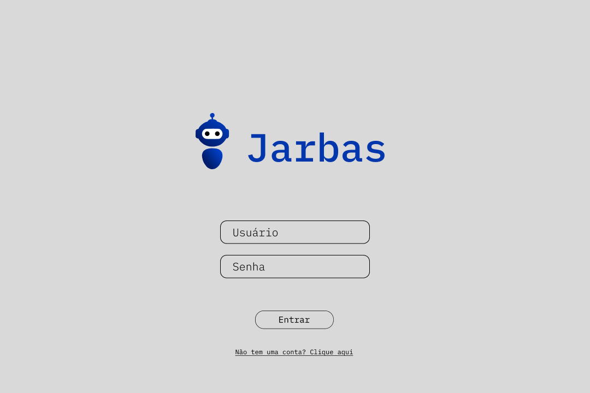
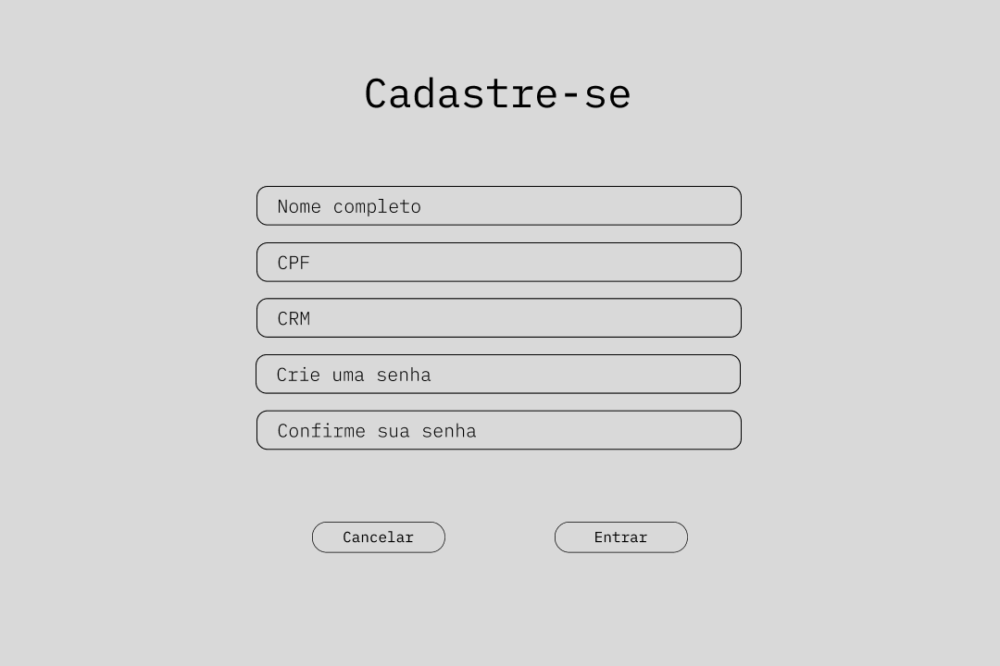
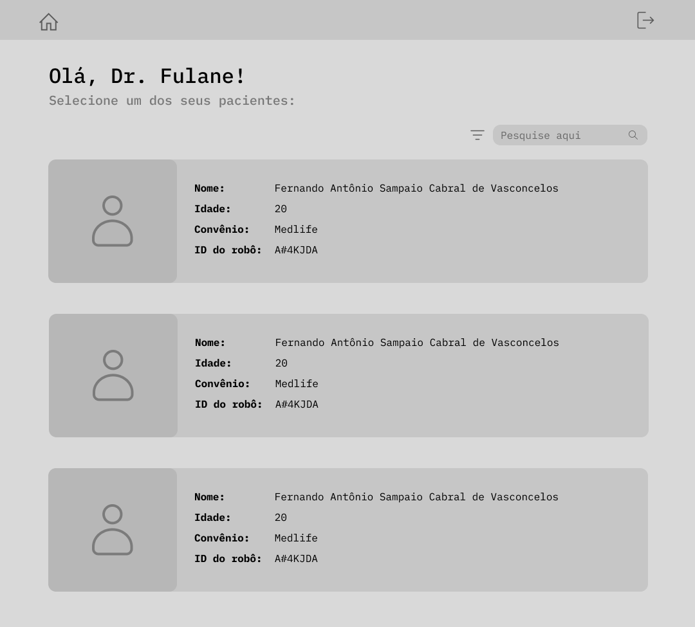
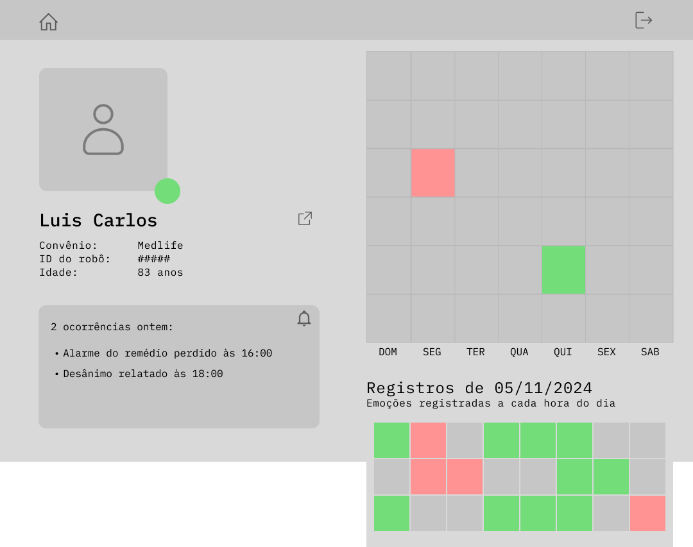
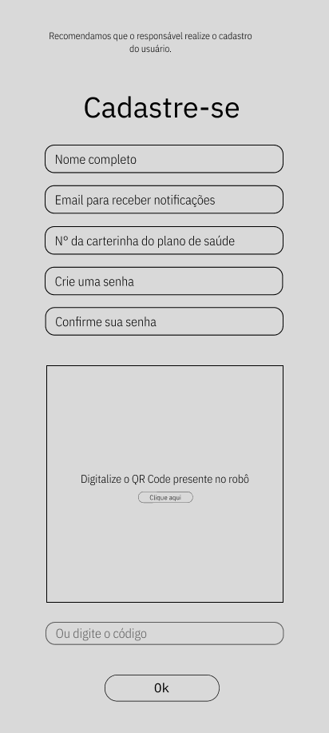
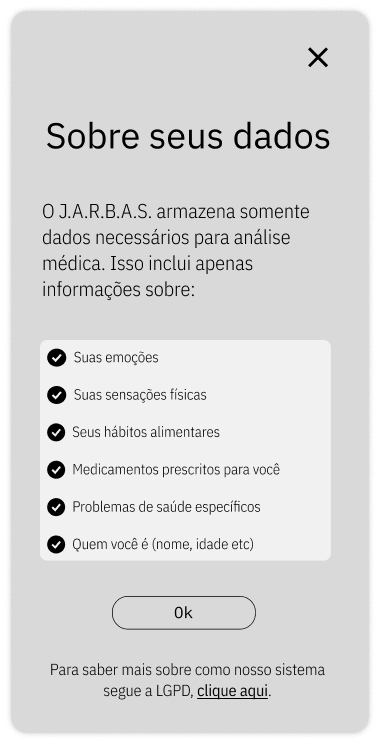
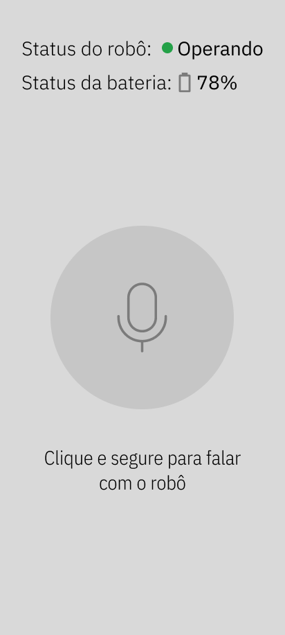
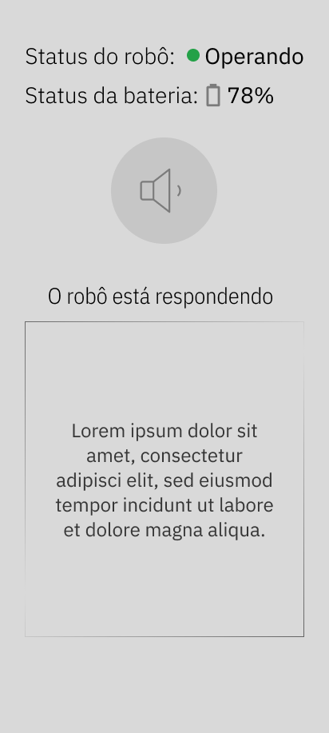

# Wireframe

O wireframe faz parte da prototipação de baixa fidelidade da solução e é a estrutura básica do layout do projeto, criada para garantir que todos os elementos necessários estejam organizados de forma intuitiva e funcional. Esse esboço inicial permite uma visualização da interface sem interferências de estilo, cores ou imagens, focando exclusivamente na experiência do usuário e no fluxo de navegação.

O principal objetivo do wireframe é estabelecer uma hierarquia visual clara e garantir que a navegação seja intuitiva. Através desse layout básico, é possível alinhar as expectativas de todos os envolvidos no projeto sobre a estrutura e organização das informações, antes de aplicar estilos visuais.

A fim de implementar esses benefícios no desenvolvimento do projeot, a equipe J.A.R.B.A.S. elaborou 2 wireframes, um para o médico e outro para o usuário da solução em si. Ambos os wireframes estão descritos nesta seção e disponíveis no Figma, [clicando aqui](https://www.figma.com/design/38TuPdoJKY07cd0pETAYyB/ID-Visual?t=MjWfPtA9cHKmi4Dx-0).

## Wireframe - Médico

### Tela de Login

**Objetivo:** A tela de login é a primeira etapa para o acesso ao sistema. Seu design simples e direto facilita a autenticação dos usuários.

Componentes:
- Campo de Usuário e Senha: Campos de entrada para o usuário inserir seu nome de usuário e senha.
- Botão Entrar: Permite ao usuário autenticar-se e entrar no sistema.
- Link para Cadastro: Texto "Não tem uma conta? Clique aqui", redireciona para a tela de cadastro.

 Figura 1 - Tela de login do médico 

Fonte: Elaborado pelo grupo J.A.R.B.A.S.

### Tela de Cadastro

**Objetivo:** Permite que novos usuários se registrem no sistema, fornecendo informações pessoais e de segurança.

Componentes:
- Campos de Cadastro:
    - Nome completo: Campo para o nome completo do usuário.
    - CPF: Campo para inserção do CPF.
    - CRM: Campo para inserção do número do CRM.
    - Senha: Campo para criação de senha.
    - Confirmação de Senha: Campo para confirmação da senha criada.
    - Botões de Ação:
    - Entrar: Finaliza o cadastro e registra o novo usuário no sistema.
    - Cancelar: Cancela o cadastro e retorna para a tela de login.

 Figura 2 - Tela de cadastro do médico 

Fonte: Elaborado pelo grupo J.A.R.B.A.S.

### Tela de Lista de Pacientes

**Objetivo:** Apresenta ao médico uma lista de pacientes associados, permitindo acesso rápido às informações de cada um.

Componentes:
- Saudação Personalizada: Exibe "Olá, Dr. Fulane!", onde "Fulane" é o nome do médico logado.
- Campo de Pesquisa: Campo para que o médico possa buscar por pacientes.
- Filtros de Busca: Ícone de filtro permite refinar a busca pelos pacientes.
- Cartão de Paciente: Cada cartão contém:
    - Imagem de Perfil (Placeholder): Indica o perfil do paciente.
    - Nome do Paciente: Nome completo do paciente.
    - Idade: Idade do paciente.
    - Convênio: Nome do convênio associado ao paciente.
    - ID do Robô: Identificação do robô associado ao paciente, utilizado no monitoramento.

 Figura 3 - Tela de home 

Fonte: Elaborado pelo grupo J.A.R.B.A.S.

### Tela de Detalhes do Paciente
**Objetivo:** Proporciona ao médico uma visão detalhada das informações e registros do paciente, incluindo alertas e monitoramento de emoções.

Componentes:
- Informações Básicas do Paciente:
- Imagem de Perfil (Placeholder): Placeholder da imagem do paciente.
- Nome, Convênio, ID do Robô, e Idade: Informações gerais do paciente para fácil identificação.
- Alertas Recentes: Exibe notificações recentes, como alarmes de medicação perdidos ou relatos de desânimo.
- Gráfico de Registro de Emoções: Um gráfico semanal e um diário, que mostra as emoções registradas pelo robô ao longo do tempo.
    - Legenda de Cores: Cada cor representa uma emoção, com quadrados coloridos indicando o estado emocional do paciente em diferentes dias e horários.

 Figura 4 - Tela de detalhes do Paciente 

Fonte: Elaborado pelo grupo J.A.R.B.A.S.

---

## Wireframe - Usuário Final

### Tela de Cadastro do Usuário Final / Responsável

Essa primeiro tela não é pensada para o usuário final (o idoso), sendo assim, colocamos uma mensagem indicando que o responsável (filho, conjuguê ou semelhantes) faça esse primeiro cadastro.

**Descrição:** Esta tela permite o cadastro de um responsável pelo robô, incluindo as informações de contato e detalhes para acesso e notificação.

**Componentes:**

Campos de Entrada:
- Nome completo: Campo para o nome completo do responsável.
- Email para receber notificações: Campo para inserir um e-mail para receber alertas e comunicações.
- CPF e identidade na área da saúde: Campos destinados a documentações de identificação do responsável, essenciais para fins de segurança e conformidade.
- Senha e confirmação de senha: Campos para definir e confirmar a senha de acesso.
- Código de vínculo com o robô: Campo para inserir o código de pareamento do responsável com o robô, garantindo que os dados sejam acessados apenas por usuários autorizados.
- Botão "Ok": Finaliza o processo de cadastro e salva as informações.

 Figura 5 - Tela de cadastro do usuário final / responsável 

Fonte: Elaborado pelo grupo J.A.R.B.A.S.

### Pop-up Aviso LGPD

Assim que o responsável conclui o cadastro, um pop-up de aviso LGPD é acionado.

**Descrição:** Um aviso sobre as práticas de coleta e armazenamento de dados, apresentado em conformidade com a Lei Geral de Proteção de Dados (LGPD).

**Componentes:** 
- Título "Sobre seus dados": Informa que o conteúdo a seguir trata da política de uso de dados.
- Descrição: Explica os tipos de dados armazenados e seu uso para análise médica.
- Lista de Informações Coletadas:
    - Emoções, sensações físicas, hábitos alimentares, medicamentos, problemas de saúde, e dados de identificação.
- Botão "Ok": Fecha o popup e retorna à tela principal.
- Link para Mais Informações sobre a LGPD: Oferece ao usuário um link para saber mais sobre o uso e a proteção dos dados.

 Figura 6 - Tela de aviso LGPD 

Fonte: Elaborado pelo grupo J.A.R.B.A.S.

### Tela Home

Essa é a primeria tela que o idoso irá interagir.

**Descrição:** Exibe o status operacional do robô e permite a interação direta através de comando de voz.

**Componentes:**
- Status do Robô: Indicação visual do estado de operação (por exemplo, "Operando" com um ícone de luz verde), permitindo ao usuário saber se o robô está funcionando normalmente.
- Status da Bateria: Percentual da bateria do robô, oferecendo uma visão rápida sobre a necessidade de recarga.
- Ícone de Microfone: O usuário pode segurar o ícone para iniciar uma interação por voz com o robô.
- Instrução para Usuário: Texto informativo que orienta o usuário a segurar o botão de microfone para falar com o robô.

A tela foi projetada com grande ícones, poucos textos, além de serem grandes para facilitar a leitura e entendimento da informação.

 Figura 7 - Tela de home do usuário final 

Fonte: Elaborado pelo grupo J.A.R.B.A.S.

### Tela Durante a Resposta do Robô

**Descrição:** Tela similar à anterior, mas destinada a exibir o status enquanto o robô está processando e respondendo ao comando do usuário.

**Componentes:**
- Status do Robô e Bateria: Mesma funcionalidade da tela anterior.
- Ícone de Resposta (Alto-falante): Indica que o robô está respondendo, com um ícone diferenciado.
- Mensagem de Resposta: Caixa de texto onde a resposta do robô é exibida para o usuário.

E por último, temos essa tela, que continua seguindo os princípios da anterior. 

 Figura 8 - Tela durante a resposta do robô 

Fonte: Elaborado pelo grupo J.A.R.B.A.S.

